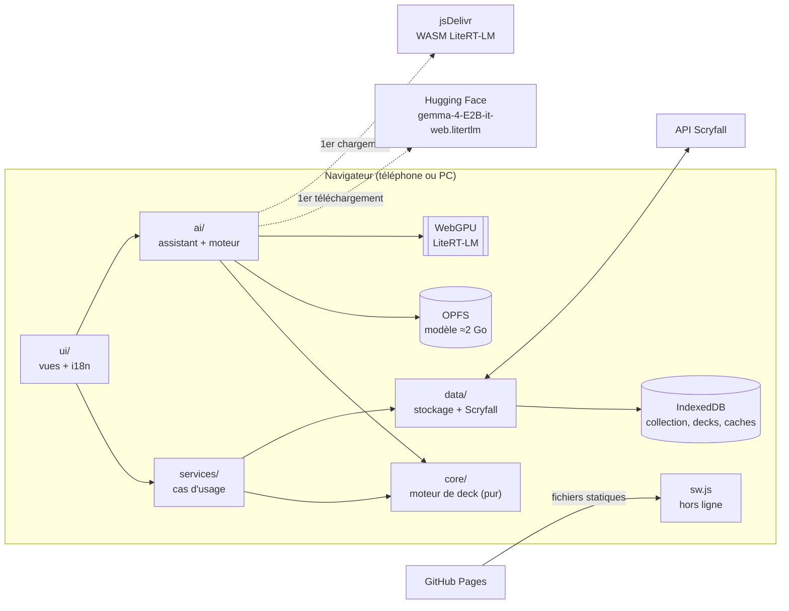
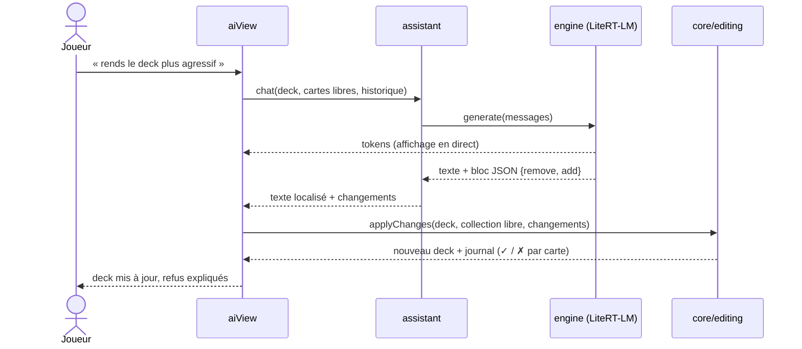
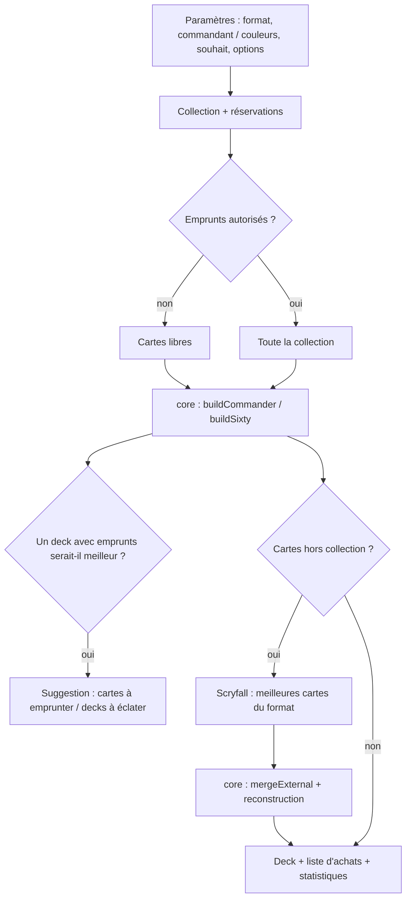

# Architecture — MTG Deck Builder

Web app **100 % côté client** (PWA) : aucun serveur à nous. Le navigateur parle directement à l'API Scryfall,
stocke la collection et les decks localement, et fait tourner l'IA (Gemma 4 E2B) sur le GPU de l'appareil.
L'hébergement est statique (GitHub Pages).

## Vue d'ensemble

## Couches

Règle de dépendance : **une couche n'importe que les couches en dessous d'elle.**
`core` ne connaît ni le DOM, ni le réseau, ni le stockage : c'est ce qui le rend testable et réutilisable.

| Couche | Dossier | Rôle | Dépend de |
|---|---|---|---|
| Interface | `src/ui/` | Vues (une par onglet), état partagé, textes FR/EN, fiche carte | services, ai, core |
| IA | `src/ai/` | Téléchargement du modèle, moteur LiteRT-LM, prompts, assistant | core, data (kv) |
| Services | `src/services/` | Cas d'usage : générer un deck (réservations, emprunts, cartes hors collection), importer, éditer | core, data |
| Données | `src/data/` | IndexedDB (dépôts collection / decks), sauvegarde JSON, client Scryfall + cache | core (constantes) |
| Domaine | `src/core/` | Rôles des cartes, scores, souhaits, construction Commander / 60 cartes, validation des modifications | — |

### `core/` — le moteur de deck
- `cards.js` : rôle d'une carte (ramp, pioche, removal, wipe…) par expressions régulières sur le texte Oracle, qualité (rang EDHREC), sous-types, base de terrains.
- `wishes.js` : transforme un souhait libre (« elfes agressif », « tokens ») en profil de thèmes / tribus / style, puis en bonus de score.
- `builder.js` : construction déterministe.
  - **Commander** : quotas par rôle (10 ramp, 10 pioche, 8 removal, 2 wipes), synergies avec le commandant, 36 terrains.
  - **60 cartes** : 4 exemplaires max, courbe plafonnée (≤ 8 cartes à 4, ≤ 4 à 5, ≤ 2 à 6+), 24 terrains.
  - **Cartes hors collection** : fusion avec les meilleures cartes du format, pénalité pour chaque exemplaire à acheter.
- `editing.js` : applique des retraits / ajouts **en les validant** (possédée, libre, légale, couleurs, maximum). Utilisé par les boutons +/− *et* par l'IA.

> Le moteur est un portage exact de la version Python historique (`legacy/pc-flask/builder.py`).
> `tests/core/builder.test.js` vérifie que les deux produisent **les mêmes decks** sur une collection de référence.

### `data/` — stockage et Scryfall
- `db.js` : connexion IndexedDB (`mtg-deck-builder`, stores `collection`, `decks`, `kv`).
- `collectionRepo.js`, `decksRepo.js` : dépôts. Les **réservations** sont calculées à partir des decks enregistrés : une carte rangée dans un deck n'est plus « libre » (on ne réserve que les exemplaires possédés, pas ceux « à acheter »).
- `backup.js` : export / restauration JSON (compatible avec l'export de l'ancienne appli PC).
- `scryfall/` : `importer.js` (CSV/JSON, pur), `mappers.js` (objet Scryfall → carte compacte, versions FR), `client.js` (HTTP, ~10 req/s), `index.js` (enrichissement par paquets de 75, noms FR par paquets de 20, recherche, meilleures cartes d'un format avec cache d'une semaine).

### `ai/` — IA locale
- `models.js` : modèle utilisé (`gemma-4-E2B-it-web.litertlm`, ≈2 Go, le seul format compatible navigateur avec Gemma 4 E2B).
- `modelStore.js` : téléchargement dans **OPFS** (système de fichiers privé du navigateur) avec progression et **reprise** par requêtes `Range` si la connexion coupe ; repli sur le Cache API.
- `engine.js` : charge `@litert-lm/core` **à la demande** (import dynamique), crée le moteur à partir du fichier OPFS, sérialise les générations (une à la fois) et diffuse les tokens.
- `prompts.js` (pur) : prompts courts adaptés à un petit modèle, extraction du bloc JSON d'échanges, suppression du raisonnement interne, **localisation** des noms de cartes (FR ↔ EN).
- `assistant.js` : analyse du deck et chat. Les échanges proposés ne sont **jamais** appliqués directement : ils passent par `core/editing.js`.

### `ui/`
- `state.js` : état partagé (langue, collection, deck courant, conversation) et abonnement aux changements de langue.
- `views/` : `collectionView`, `buildView`, `decksView`, `moreView`, `aiView`. Chaque vue a un `init()` (branchement des événements) et des fonctions de rendu.
- `main.js` : assemble les vues, gère les onglets et enregistre le service worker.

## Flux de génération d'un deck

## Choix techniques

| Sujet | Choix | Pourquoi |
|---|---|---|
| Plateforme | PWA statique | Un seul code pour téléphone et PC, installable, hors ligne, hébergement gratuit. |
| Outillage | Vite + JavaScript (ES modules) | Build rapide, découpage automatique (le moteur IA n'est chargé qu'à l'usage), pas de framework à apprendre. |
| Stockage | IndexedDB (+ OPFS pour le modèle) | Gros volumes possibles, persistant ; OPFS lit le modèle depuis le disque sans tout charger en mémoire. |
| IA | LiteRT-LM + Gemma 4 E2B (WebGPU) | Bibliothèque officielle Google pour l'inférence navigateur ; MediaPipe LLM Inference n'est plus maintenu. E2B (≈2 Go) est le plus gros modèle raisonnable sur téléphone. |
| Fiabilité de l'IA | Sortie JSON + validation par `core` | Un modèle de 2 milliards de paramètres se trompe parfois (cartes inventées, JSON cassé) : le code reste maître des règles. |
| Données cartes | API Scryfall | Gratuite, sans clé, autorise les appels navigateur, fournit noms FR, légalités, prix et rang EDHREC. |
| Tests | Vitest + fake-indexeddb | Teste le domaine, les dépôts et l'assistant (moteur IA simulé) sous Node, en CI. |
| CI/CD | GitHub Actions → Pages | Tests et build à chaque push, déploiement automatique depuis `main`. |

## Limites connues
- **IA** : nécessite WebGPU (Chrome Android récent, Safari iOS 26+, Chrome/Edge PC) et ≈2 Go de stockage ; prévoir ~6 Go de RAM. LiteRT-LM JS est en préversion.
- **Qualité des decks** : le score de puissance repose sur la popularité EDHREC, pas sur des synergies fines.
- **Données locales** : effacer les données du navigateur efface la collection → exporter des sauvegardes.

## Pistes
- Fournisseur IA « Ollama sur le PC » (même interface que `engine.js`).
- Synergies réelles via les données EDHREC par commandant.
- Appels d'outils (tool calling) LiteRT-LM pour laisser l'IA interroger la collection.
- Migration progressive vers TypeScript.
